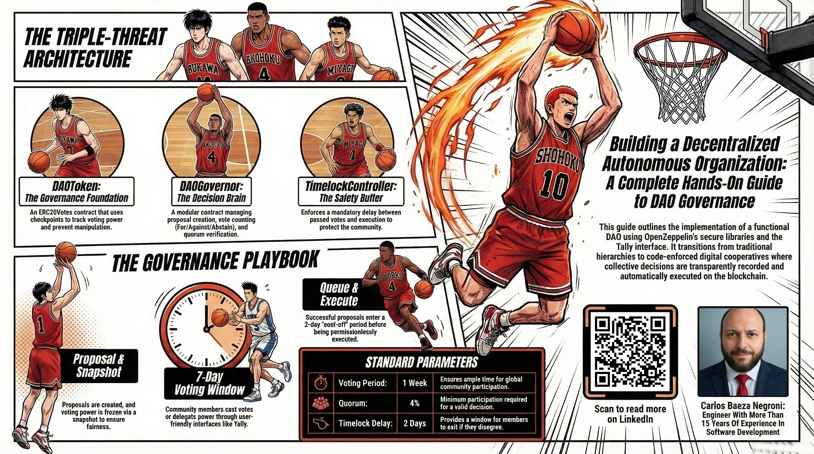
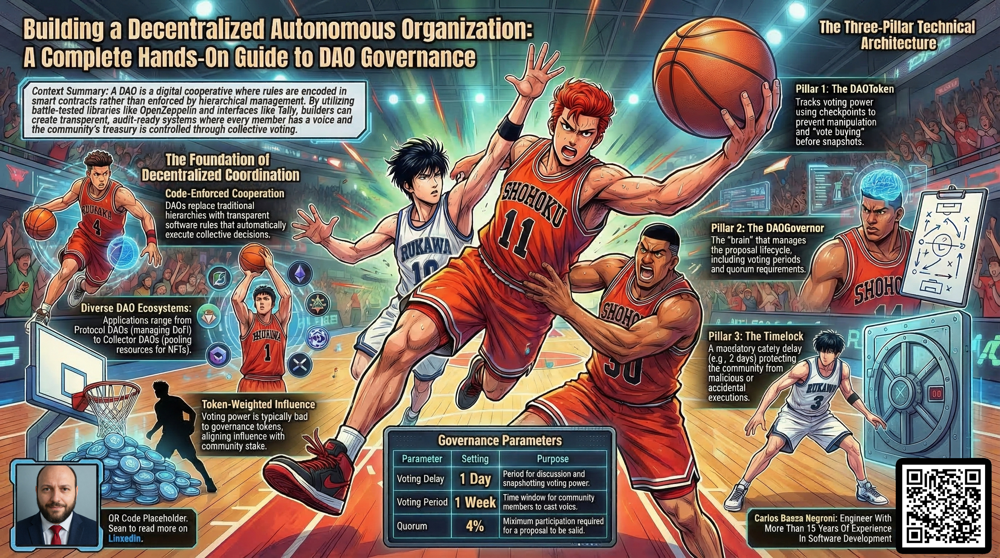
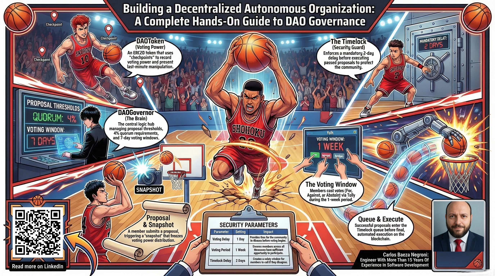
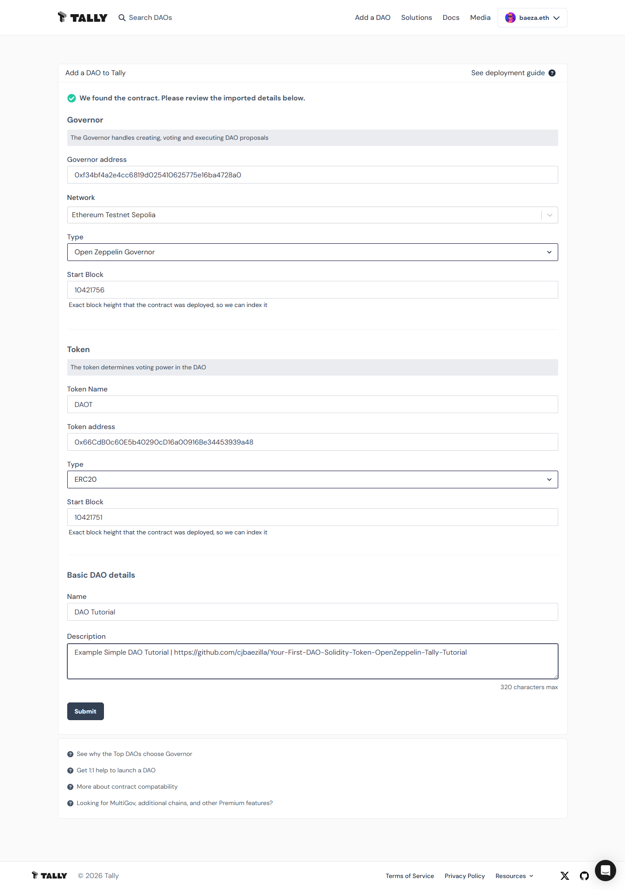
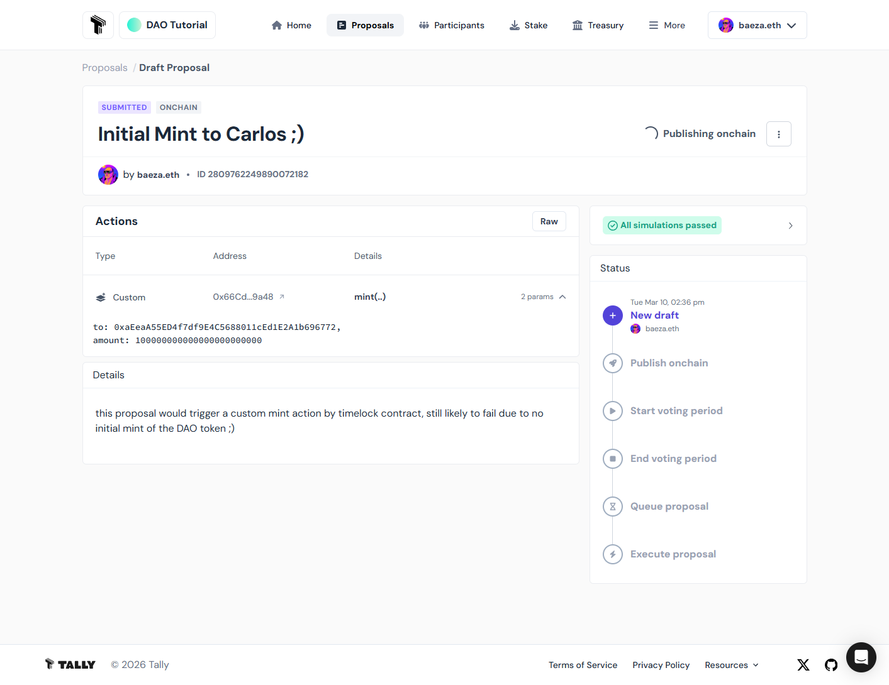
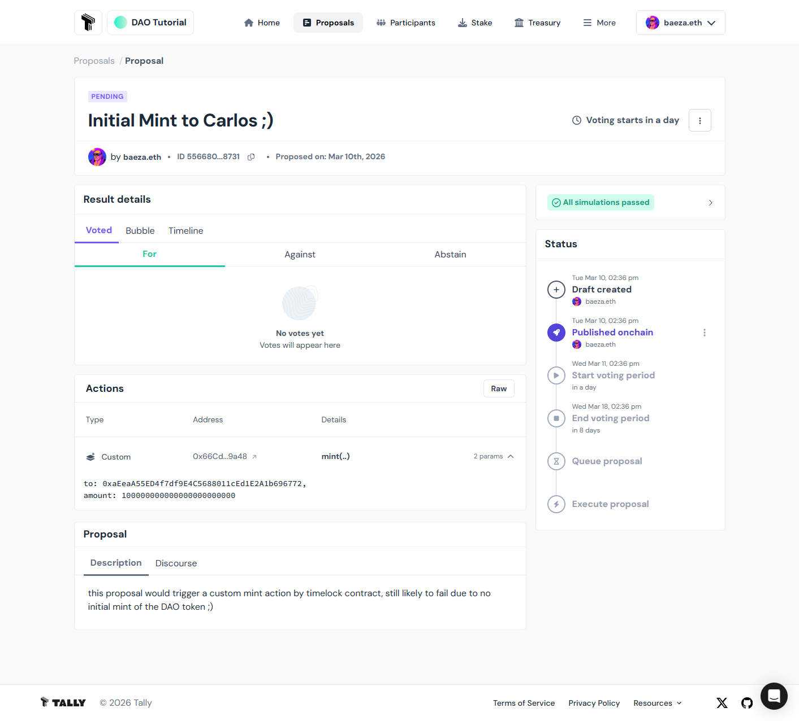
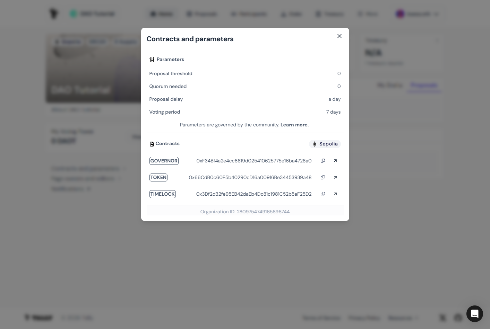

# Building a Decentralized Autonomous Organization: A Complete Hands-On Guide to DAO Governance


I'm pleased to present a fully functional decentralized autonomous organization governance system that empowers communities to make collective decisions in a transparent and democratic manner. What I've created provides an effective approach to how people can work together and govern themselves, offering an alternative to traditional hierarchical structures. This isn't some abstract concept locked in research papers. It's a working system that anyone can use to build their own community-driven organization, and it's designed as a hands-on learning experience. Through this guide, you'll learn step by step using OpenZeppelin's secure smart contract library and Tally's user-friendly interface, gaining the practical skills needed to launch and manage your own DAO. My mission is to make decentralized governance accessible to everyone, regardless of technical background. I aim to equip you with real, usable knowledge that enables you to become a DAO builder. The available tools and documented approaches support exploring how this technology can enable new ways for communities to organize, make decisions, and create value.

- **Github Repository With Working Solidity Contracts:** https://github.com/cjbaezilla/Your-First-DAO-Solidity-Token-OpenZeppelin-Tally-Tutorial


## What Are DAOs?

When I first encountered the concept of DAOs, I was struck by how they reimagine something fundamental: how people organize themselves to pursue common goals. A DAO, which stands for decentralized autonomous organization, represents a new way for communities to govern themselves collectively through code rather than through traditional corporate hierarchies or government structures. At its heart, a DAO is simply a group of people who have agreed to follow a set of rules encoded in software that automatically executes collective decisions. Think of it as a digital cooperative where every member has a voice, and the rules are enforced not by managers or bosses but by transparent computer programs running on a blockchain.

What makes this approach powerful is that the rules live in smart contracts, which are self-executing programs that cannot be altered without the explicit consent of the community. This creates a level of trust and transparency that's difficult to achieve in traditional organizations. When a DAO makes a decision, that decision executes automatically according to the predefined rules, and the entire process is recorded permanently on the blockchain where anyone can audit it. There are no hidden meetings, no backroom deals, and no single person who can unilaterally change the rules or divert funds. The treasury, which represents the community's shared resources, is controlled collectively through voting, and every transaction is visible to all members.

I want to emphasize that DAOs are not some futuristic fantasy; they exist today and are already managing substantial resources across various domains. From decentralized finance protocols that govern billions in user funds to creator communities that coordinate artistic projects, from investment clubs that pool capital to purchase valuable assets to social groups that organize around shared values, DAOs are experimenting with new forms of human coordination. What excites me most is how accessible this model can be. Anyone with an internet connection and a small amount of cryptocurrency can participate in or create a DAO, breaking down geographical and institutional barriers that traditionally limited who could participate in collective decision making.

The foundation of most DAO governance is the token. When you hold governance tokens in a DAO, those tokens represent your stake in the community and typically grant you voting power on proposals. The token economics vary. Some DAOs use a one-token-one-vote model where voting power correlates with financial stake, while others use non-transferable soulbound tokens or NFT-based voting where each member gets equal representation regardless of holdings. This flexibility allows different communities to choose the governance model that best suits their values and objectives. What matters is that the voting mechanism is transparent, mathematically fair, and resistant to manipulation.

The history of DAOs teaches us both the promise and the perils of this approach. The conceptual seeds were planted around 2013 within early cryptocurrency communities dreaming of decentralized organizations, but the first major experiment arrived in 2016 with a project simply called The DAO. This ambitious venture conducted a token sale on the Ethereum blockchain and raised over $150 million from thousands of contributors worldwide. It was meant to function as a decentralized venture capital fund where token holders would vote on investment proposals. The enthusiasm was palpable. Here was a real-world test of whether strangers could coordinate effectively through code alone.

Unfortunately, The DAO's launch was followed by one of the most infamous events in cryptocurrency history. Unknown attackers exploited a vulnerability in the smart contract code and drained approximately $60 million worth of Ethereum. The incident sent shockwaves through the emerging ecosystem and forced a painful reckoning about security practices. What happened next became legendary: the Ethereum community ultimately decided to hard fork the blockchain to restore the stolen funds, creating two separate chains. Ethereum continued with the reversal, while Ethereum Classic persisted with the original immutable ledger. This fork demonstrated that even decentralization has its limits when catastrophic failures occur, and it taught the industry invaluable lessons about the critical importance of rigorous code auditing, formal verification, and conservative design patterns.

From that difficult beginning, DAOs have matured dramatically. Today's landscape features thousands of active DAOs managing billions of dollars in assets, ranging from protocol governance DAOs that control decentralized finance applications like Uniswap and Compound, to collector DAOs around NFT projects like PleasrDAO that pool resources to acquire culturally significant digital art, to investment syndicates like Flamingo DAO that tokenize NFT ownership, to grant-making organizations like MolochDAO that fund Ethereum infrastructure development, to social clubs and media companies experimenting with community ownership. The diversity is striking and shows how adaptable the DAO model can be.

What continues to inspire me is the culture of open-source collaboration that surrounds DAO development. Most DAO codebases are publicly auditable, with contracts published on blockchain explorers for anyone to examine. Security firms specialize in auditing these contracts, and insurance protocols like Nexus Mutual have emerged to provide coverage against technical failures. The tooling ecosystem has expanded enormously. Governance frameworks like OpenZeppelin Governor and Aragon provide battle-tested templates that save communities from reinventing the wheel, while user interfaces like Tally, Snapshot, and Commonwealth make participation accessible to non-technical users. The learning curve remains steep, but it's getting shallower as better documentation and educational resources become available.

The potential applications extend far beyond financial governance. I see DAOs being used for climate action collectives that coordinate sustainability initiatives, for musician communities that share royalties and decision-making, for academic research groups that manage funding and publication rights, for city planning experiments that give residents direct input on local decisions, and for global public goods funding. The common thread is that DAOs excel at coordinating groups of people who may not know each other personally but share aligned incentives and want to make decisions transparently rather than relying on centralized authority.

Yet I also recognize the challenges. Legal status remains uncertain in many jurisdictions. Are DAOs partnerships? Corporations? Something entirely new? Regulatory clarity is evolving unevenly. Participation often suffers from low voter turnout, as token holders may not have time or expertise to evaluate proposals. Governance attacks like vote buying and sybil attacks (creating multiple identities to gain voting power) remain concerns. The technical complexity can be intimidating, and the consequences of poorly designed governance can be severe. These limitations don't mean DAOs are doomed; they mean we have much to learn about designing effective decentralized systems that balance efficiency with fairness, agility with security, and inclusivity with resilience.

What gives me optimism is that these challenges are being addressed through iterative improvement. New voting mechanisms like quadratic voting and conviction voting aim to better represent the intensity of preferences while preventing whale domination. Experiments with delegated voting allow expertise to concentrate while maintaining broad participation. Hybrid approaches blend on-chain governance with off-chain signaling to reduce transaction costs. Regulatory frameworks are gradually emerging to give DAOs clearer legal standing. Most importantly, the global community of DAO builders shares knowledge openly, learning from failures and successes alike.

To me, DAOs represent more than just a technological innovation; they embody a philosophical shift toward greater transparency, democratic participation, and collective ownership. They challenge the assumption that organizations must be pyramid-shaped with power concentrating at the top. They ask whether we can build systems where rules apply equally to everyone, where community members can verify processes for themselves, and where power flows from the bottom up rather than being decreed from above. I don't believe DAOs will replace corporations or governments entirely, but I do think they offer a compelling middle path. They are organizations that are neither top-down bureaucracies nor completely anarchic, but rather places where members actively shape their shared destiny through transparent, rules-based processes.

If you're curious about DAOs but feel overwhelmed by the technical details, I want to assure you that understanding comes incrementally. Start by joining an existing DAO as a spectator, observe how proposals are made and voted on, ask questions in community forums, and gradually deepen your involvement. The beauty of this space is that participation itself builds understanding. Every voice matters in these experiments, and we're all learning together how to make decentralized governance work at scale. What I've built here is one contribution to that ongoing exploration. It's a practical demonstration of how secure, transparent governance can be implemented using proven components. Consider it an invitation to explore what decentralized communities can achieve when they govern themselves with clarity and shared purpose.


## Different Types of DAOs

I want to share with you the remarkable variety of DAOs that exist today because it demonstrates how adaptable this governance model can be. When I explore the DAO landscape, I see communities using this technology to solve real human problems in ways that traditional organizations cannot. Each type of DAO represents a different application of the same core principles: transparent rules, collective decision making, and automated execution through code.

Protocol DAOs represent one of the most mature and influential applications of this technology. These DAOs govern decentralized finance protocols that have grown to manage billions of dollars in user funds. When you interact with a lending platform like Compound or a decentralized exchange like Uniswap, those protocols are often governed by token holders who vote on critical decisions. I find it fascinating that these communities decide everything from fee structures that affect thousands of users to technical upgrades that must balance security with functionality. The treasury management decisions made by these DAOs determine how protocol revenue is used, whether to distribute profits to token holders, or how to fund further development. What impresses me most is that these protocols operate without a traditional corporate structure; instead, they rely on token holders who have skin in the game to make decisions that benefit the long-term health of the system. The governance tokens function like shares in a cooperative but with the transparency of all actions recorded onchain for anyone to audit.

Collector DAOs have captured my imagination because they blend digital ownership with community coordination in such a natural way. These DAOs form around NFT collections, creating communities where each token represents membership and voting rights. I think of PleasrDAO, which started as a group of collectors pooling resources to acquire culturally significant digital artwork, or Flamingo DAO that tokenizes NFT ownership to allow fractional investment in high-value pieces. What makes collector DAOs special is that the NFT itself becomes the membership badge, creating a powerful alignment between artistic or cultural value and governance participation. These communities decide collectively how to use their shared funds, whether to acquire new pieces, license existing artwork for commercial use, or collaborate on new creative projects. The governance model works beautifully here because each unique NFT typically grants one vote regardless of how many copies an individual owns, preventing whales from dominating decisions and ensuring each distinct member has equal voice. I see collector DAOs as pioneering new forms of digital patronage where artists and collectors form lasting relationships governed by shared rules rather than transactional interactions.

Investment DAOs extend this coordination model to the world of finance in ways that democratize access to opportunities that were once reserved for accredited investors. These DAOs pool capital from many participants and make collective investment decisions through voting. I'm thinking of structures where members propose startup investments, real estate acquisitions, or venture capital deals, and the community evaluates and votes on each opportunity. The treasury is managed transparently onchain, and every investment decision follows the same governance process. What excites me about investment DAOs is their potential to aggregate small amounts of capital from many people and direct it toward projects that traditional finance might overlook. The governance mechanism ensures that investment decisions reflect the wisdom of the crowd rather than the preferences of a single fund manager. However, I also recognize that these DAOs face regulatory challenges as securities laws evolve to address this new form of collective investing. Still, the experiment itself is valuable, showing how communities can pool resources and make sophisticated financial decisions together.

Social DAOs are perhaps the most ambitious because they attempt to recreate the feeling of a tight-knit community with shared values but in a digital-first, globally distributed format. These DAOs often require members to hold specific tokens or NFTs to gain access to private channels, events, or shared resources. I view social DAOs as digital clubs where membership itself carries meaning beyond financial gain. Some function like exclusive professional networks, others like creative collectives, and still others like social clubs with physical meetups coordinated through digital governance. What makes social DAOs work is that they align incentives around shared identity and purpose rather than purely financial returns. Members might collectively fund a common workspace, organize conferences, publish research, or support each other's projects. The governance decisions reflect what kind of community they want to build together. I'm particularly interested in how social DAOs experiment with new economic models for creative work, knowledge sharing, and mutual support that don't fit neatly into traditional employer-employee or contractor relationships. These DAOs ask whether we can build meaningful community and belonging through transparent rules rather than hierarchical management.

Grant DAOs represent one of the most socially valuable applications because they direct funding toward public goods and ecosystem development. These DAOs receive donations or generate revenue through fees and then distribute grants to builders, researchers, artists, and community organizers. I think of organizations like Ethereum's own ecosystem funds that have supported countless infrastructure projects, or Gitcoin Grants that use quadratic funding to amplify small donations. The governance process typically involves community members proposing grantees, deliberating on impact, and voting on allocations. What makes grant DAOs powerful is that they create sustainable funding mechanisms for work that might not attract traditional venture capital but that benefits the entire ecosystem. The transparency means donors can see exactly where their contributions go, and the democratic process ensures funding decisions reflect community priorities rather than the preferences of a small foundation board. I've watched grant DAOs evolve sophisticated processes for evaluating proposals, with reviewers providing expertise and delegates representing broader community interests. This model could transform how we fund open source software, scientific research, and cultural production.

Media DAOs are experimenting with fundamentally new approaches to content creation and journalism. These DAOs have token holders who vote on editorial directions, content priorities, and even specific stories to pursue. I see models where journalists are funded directly by the community rather than by advertisers or subscriptions, creating independence from traditional media economics. Some media DAOs allow members to curate what gets published, others let token holders fund investigative projects through proposals, and still others experiment with attribution and revenue sharing where contributors receive tokens representing their work. What draws me to media DAOs is their potential to realign incentives between creators and audiences. When the audience has a stake in the governance, editorial decisions naturally consider what serves the community's information needs rather than clickbait metrics. I want to be clear that these experiments are early and face genuine challenges around journalistic standards and sustainability. Yet they represent important thinking about how we might rebuild trust in media through transparency and shared ownership.

The flexibility of this model continues to amaze me because any group with a common purpose can adapt DAO structures to their specific needs. I've seen education DAOs that coordinate learning communities, climate DAOs that fund sustainability initiatives, and even city planning experiments that give residents direct input on local decisions through token-based voting. The common thread is that these communities want transparent, rules-based coordination without concentrating power in any single individual. They want members to verify processes for themselves rather than trusting opaque institutions. They want the ability to evolve governance as they learn what works, with changes themselves following the same democratic process. This adaptability is why I believe DAOs could complement many existing organizations rather than replacing them entirely. They offer a middle path between rigid bureaucracy and chaotic anarchy, providing structured flexibility where communities write their own rules and hold each other accountable through code.

When I think about these different types, I'm struck by how each one solves a specific coordination problem that traditional structures handle poorly. Protocol DAOs enable global technical communities to govern shared infrastructure. Collector DAOs create new models for cultural stewardship. Investment DAOs democratize capital allocation. Social DAOs build belonging across distances. Grant DAOs fund work that benefits everyone. Media DAOs experiment with sustainable journalism. Together they show that decentralized governance isn't a one-size-fits-all solution but rather a toolkit that communities can customize to their unique circumstances. The learning from each experiment feeds the whole ecosystem, and as tools improve and legal frameworks evolve, I expect to see even more creative applications. What gives me hope is that these communities are not just building technology. They're exploring new ways for people to work together with shared purpose and mutual accountability. That human element, the collective intelligence of diverse groups solving problems together, is what truly excites me about the DAO movement.


## My Implementation: The Technical Foundation

When I decided to build my own DAO governance system, I wanted to create something that was both secure and understandable, something that could serve as a solid foundation for communities to govern themselves effectively. I chose to build using OpenZeppelin Contracts because these are the most trusted and widely used smart contract libraries in the industry. OpenZeppelin has spent years developing, testing, and auditing their code through extensive security research and community review. By using their contracts, I am standing on the shoulders of giants rather than trying to reinvent complex security mechanisms myself. Their Governor contracts provide a complete governance framework that I can customize to fit the specific needs of any community while inheriting the security that comes from years of collective experience.

My system consists of two main contracts that work together seamlessly. The first contract, called DAOToken, handles the creation and management of governance tokens that represent voting power. The second contract, called DAOGovernor, manages the entire proposal process from creation through voting to execution. These two contracts are connected through a third component called TimelockController, which adds a crucial safety delay before any approved proposals take effect. This three-part architecture creates a balanced system where no single component has too much power, and every significant action requires community approval.

I want to explain why I chose this particular structure and how it works in practice. The DAOToken follows the ERC20 standard that most people recognize as a digital token, but it includes special governance features that allow it to track voting power accurately. When someone holds these tokens, they can participate in governance decisions. The token includes checkpointing functionality, which means it records the balance of each holder at specific moments in time. This is essential for fair voting because it prevents people from buying votes right before a proposal passes or selling their tokens immediately after voting. The snapshot is taken at a predetermined time, freezing everyone's voting power for that particular proposal so that results reflect genuine community sentiment rather than last-minute manipulation.

The DAOGovernor contract is where the actual governance logic lives. It inherits from multiple OpenZeppelin modules, each providing a specific piece of functionality. GovernorSettings allows me to configure time parameters like how long voting lasts and how long the delay period should be. GovernorCountingSimple provides the basic voting mechanism with options to vote for, against, or abstain. GovernorVotes connects to the token contract to read each person's voting power from the checkpoints. GovernorVotesQuorumFraction determines what percentage of total supply must participate for a proposal to be valid. GovernorTimelockControl integrates with the TimelockController to ensure that passed proposals cannot execute immediately but must wait for a safety period.

This modular approach gives me flexibility to adjust exactly what my DAO needs without unnecessary complexity. If I want to use a different token contract later, I can deploy a new governor that points to the new token. If the community decides through a vote that we need longer voting periods, we can change those parameters through the governance process itself. The system is designed to evolve as the community learns what works best. The constructor takes two parameters: the token address and the timelock address, and wires everything together. This separation of concerns makes the system maintainable and upgradeable over time.

Now I should address an important design choice I made about voting power distribution. Most DAOs use ERC20 tokens where each token represents one vote, meaning that someone who holds more tokens has more influence. This approach aligns Voting power with financial stake, which works well for protocols where those with more investment should have more say in the direction. However, I am aware that some communities prefer a different approach using ERC721 NFTs where each unique NFT gives one vote regardless of how many an individual owns. This prevents large holders from dominating decisions and ensures each distinct member has equal representation. My current implementation uses ERC20 because it suits the use case I had in mind, but the OpenZeppelin framework supports both approaches and the choice can be adapted to different community values.

Understanding the constructor parameters helps clarify how I set up the initial governance rules. For the token contract, I passed the deployer's address as the initial owner. The owner initially has special powers to mint new tokens and to pause all token transfers in case of emergencies. After deployment, I transferred ownership of the token to the TimelockController, which means those emergency powers can only be exercised through a governance vote. This is an important step toward decentralization because it prevents any single person from unilaterally controlling critical functions.

For the TimelockController, I set the minimum delay to 172800 seconds, which is 2 days. This means that once a proposal passes, it cannot execute for at least 2 days. This delay gives the community time to react if they disagree with a decision. They could choose to exit the DAO or work to overturn the decision through another vote. I set the proposers to an empty array initially, meaning no addresses were whitelisted to propose directly to the timelock, and I set executors to the zero address, which means anyone in the community can trigger execution once the delay period ends. The admin was set to the deployer initially but can be transferred to the timelock later to complete the decentralization process.

For the governor contract itself, I configured several time parameters. The voting delay is set to 1 day, meaning there is a 24-hour waiting period after a proposal is created before voting can begin. During this delay, the snapshot is taken that freezes voting power for that proposal. The voting period is set to 1 week, giving community members a full 7 days to review proposals and cast their votes. I set the proposal threshold to 0, meaning there is no minimum number of tokens required to create a proposal. Anyone can propose regardless of their token holdings. This keeps participation open and prevents barriers to entry. The quorum is set to 4%, meaning that at least 4 percent of all circulating tokens must vote for a proposal to be valid. This ensures that decisions have broad community involvement rather than being made by a small minority.

All these parameters can be changed later through the governance process itself. If the community decides that a different voting period works better or that a higher quorum is needed for important decisions, they can propose and vote on those changes. This adaptability is one of the strengths of the system. It can grow and evolve with the community's needs.

Now I want to address how people actually interact with this governance system in practice. While it is technically possible to call the smart contract functions directly using a wallet like MetaMask, that approach would be quite technical and intimidating for most users. This is where governance interfaces like Tally become invaluable. Tally is an intuitive web interface that connects to your cryptocurrency wallet and presents governance information in a user-friendly way. When you connect your wallet to Tally and navigate to your DAO's page, the interface automatically detects the governor contract and displays all the governance parameters in plain language. You can see active proposals, read their descriptions, check current vote counts, and see how much time remains. You can cast your vote with just a few clicks, and Tally handles all the complex transaction signing and submission behind the scenes.

Tally also supports delegation, which is an important feature because not everyone has time to evaluate and vote on every proposal. Through delegation, you can assign your voting power to someone you trust who will represent your interests. It is important to understand that delegation does not give the delegate access to your tokens. They cannot transfer or spend them. They only receive the ability to cast votes on your behalf. This mechanism helps governance remain efficient while still being inclusive, as delegates can specialize in analyzing proposals and representing the interests of many token holders who may be too busy to participate directly.

The integration with OpenZeppelin contracts is seamless because these contracts follow standards that governance interfaces like Tally understand. The events emitted by the governor, such as ProposalCreated, VoteCast, and ProposalExecuted, contain all the information that indexing services and frontends need to build their interfaces. Our governor is fully compatible with Tally and similar platforms, which means token holders can participate without needing to understand the technical details of smart contract interactions.

I want to emphasize how critical OpenZeppelin's contribution has been to making DAOs safe and accessible. Without their work, every team would have to build governance systems from scratch, introducing countless security risks and reinventing solutions that have already been thoroughly tested. OpenZeppelin has invested years in researching attack vectors, getting contracts audited by top security firms, and building a large community of developers who constantly review and improve the code. When I use their contracts, I am inheriting years of collective security wisdom that would be impossible to replicate on my own.

OpenZeppelin's modular architecture is particularly effective for governance systems. Instead of creating one massive contract that tries to do everything, they have broken governance into independent modules that can be combined as needed. The Governor module provides the core proposal lifecycle. GovernorVotes handles token-based voting power calculations. GovernorTimelockControl adds execution delays. This modularity means I can select exactly the features my DAO requires without including unnecessary complexity. It also means that if OpenZeppelin discovers a vulnerability in one module and releases a fix, I can upgrade my implementation much more easily than if everything were tangled together in a single contract.

Beyond the code itself, OpenZeppelin maintains extensive documentation and examples, which were extremely helpful as I learned to assemble all the pieces. They also have an active community around their work, with forums, Discord channels, and GitHub discussions where developers share insights and best practices. This is not just a code library. It is an entire ecosystem that supports secure decentralized governance and makes it accessible to people who are not security experts.

Looking ahead, I see tremendous potential in this technology. It enables organizations that are completely transparent, with every proposal, vote, and transaction permanently recorded on the blockchain for anyone to audit. It supports organizations that are truly democratic, allowing participation regardless of geography or traditional barriers to entry. And it enables resilient organizations where no single person has unilateral power to change the rules or misappropriate funds. My system represents a starting point, a solid foundation built on proven components. As the community grows and learns what works, we can adjust parameters through governance. We might want longer voting periods to encourage more deliberation. We might raise the quorum requirement for particularly important decisions. We might add special voting mechanisms for certain types of proposals. The beauty is that these changes can themselves happen through governance, following the same rules we established. The system evolves organically through the collective wisdom of the community.

I am eager to see how people use this implementation. Will it be for managing a protocol's treasury? For funding community projects? For making collective decisions about product direction? There are many possible applications. And because everything is open source and built on established standards, others can learn from this implementation and build even better systems. What I have created is not the final answer to governance. It is one contribution to the collective experiment in decentralized governance. If you are curious about DAOs or want to start one yourself, I encourage you to get involved. The available tools continue to improve, the community is supportive, and we are all learning together. The evolution of governance continues, and I am proud to contribute to this effort.

Now I would like to give you a clear picture of what happens inside these smart contracts, explained in plain language so you can understand exactly how our DAO functions even if you have no programming background. When you understand what is under the hood, you will have more confidence in how the system operates and why it is secure.

Our token contract, called DAOToken, is the foundation of governance power. I started with OpenZeppelin's ERC20 implementation because that is the trusted standard for digital tokens on Ethereum. But I needed more than a simple token. I needed one that could track voting power through checkpoints and support governance features. The contract inherits from multiple extensions: ERC20 provides basic token functionality; ERC20Burnable allows token holders to permanently destroy their tokens if they wish; ERC20Pausable gives emergency power to stop all transfers; Ownable gives administrative control to the deployer; ERC1363 makes the token more versatile for contract interactions; ERC20Permit enables gasless approvals using signed messages; and ERC20Votes is the crucial extension for governance. It creates the checkpoints that record token balances at specific moments in time.

The constructor is simple: it sets the token name to "DAOToken" and symbol to "DAOT", configures the permit system, and assigns an initial owner. The owner has special powers initially but, as I mentioned earlier, I transferred ownership to the Timelock after deployment to decentralize control. The owner can pause and unpause the token. When pause is called, all token transfers get blocked immediately. This is like hitting an emergency brake. If there is a security issue or an exploit, we can stop further damage. The owner can also mint new tokens, creating additional supply for grants, rewards, or other purposes. Because only the owner can perform these actions and ownership sits with the Timelock, these powers require governance approval. Any minting or pausing must be proposed and voted on by the community.

The most important part for governance is how the token tracks voting power. The contract has an internal function that gets called whenever tokens are transferred, minted, or burned. This function updates balances and creates checkpoints that record the new balance at the current block or timestamp. Those checkpoints are what the Governor reads later to determine voting power at specific snapshot times. The token also implements functions that tell the Governor whether to measure time using block numbers or timestamps. Right now we are using timestamp mode, which means time is measured in seconds. This is important because the Governor needs to know exactly when voting periods start and end. The token also supports the permit system with nonces that prevent replay attacks, making gasless approvals secure.

Now let's explore the Governor contract, which orchestrates the entire governance process. This contract handles proposal creation, voting, and execution. It is the brain of the operation. The constructor wires everything together by inheriting from multiple modules. Governor provides the core proposal lifecycle. GovernorSettings sets the time parameters: votingDelay of 1 day, votingPeriod of 1 week, and a minimum threshold of 0 meaning anyone can propose. GovernorVotes connects to our token contract to read voting power. GovernorVotesQuorumFraction sets quorum at 4 percent of total supply. GovernorTimelockControl integrates with the TimelockController for secure delayed execution. The constructor takes two parameters: the token address and timelock address, linking these contracts together.


## Understanding the Governor: Compound vs Custom

When I first started exploring how to build a governance system for my DAO, I naturally looked at what other successful projects were doing. Compound, the decentralized lending protocol, has one of the most well-known governance systems in the entire blockchain space. Their governor contract, often called Compound Governor, emerged from real-world experience managing billions of dollars in user funds. What impressed me about Compound's approach was how it balanced security with practicality, creating a system that could handle serious financial decisions while remaining understandable to token holders. Compound Governor became a blueprint that many early DAOs followed, and its design decisions were battle-tested through years of operation.

However, as I studied Compound Governor more deeply, I realized that while it worked brilliantly for their specific needs, every community is different. Compound's governance needs to manage technical parameters for a complex financial protocol, and their token holders are likely to be highly informed about the technical details. They set their voting delay at about two days, their voting period lasts five days, and they require a relatively high quorum to ensure decisions have broad participation. These settings make sense for a protocol handling large sums of money where decisions need careful consideration. But what if you're building a small creative collective that wants to move faster? Or a social club that prioritizes inclusivity over strict thresholds? What if your community wants different voting options or special rules for certain types of proposals? Compound Governor, while excellent, comes with a fixed architecture that's harder to modify without deep technical changes.

This is where my approach with a custom governor built from OpenZeppelin modules offers real advantages. Instead of adopting a one-size-fits-all solution, I can compose exactly the pieces I need and configure them to match my community's character. When I describe this to people, I often use the analogy of building with LEGO blocks versus buying a pre-assembled set. Compound Governor is like a beautifully designed pre-built set that works perfectly out of the box. But if you want to change the shape or add new features, you have to do some serious rebuilding. My modular governor is like having individual LEGO blocks that follow standard sizes. I can assemble them in the configuration that fits my vision, and later I can swap out pieces or rearrange them as my community evolves.

Let me walk you through the modules I'm using and why each one matters, because together they create a system that's both powerful and adaptable. The first module is GovernorSettings, which I think of as the control panel for all the time-based rules in our governance. This module lets me set exactly how long each phase of the proposal process lasts. I can decide how much notice people get before voting starts, how long the voting window remains open, and how long passed proposals wait before they can be executed. These timing parameters shape the entire rhythm of community decision-making. A short voting period might keep things moving quickly but could exclude people who need more time to consider complex issues. A long voting period encourages careful deliberation but might slow down urgent decisions. With GovernorSettings, I'm not locked into someone else's idea of timing; I can adjust these settings to match my community's pace and culture, and I can change them later through governance if we learn that different timing works better.

GovernorCountingSimple handles the actual voting mechanism, and while it might sound technical, what it does is quite straightforward: it provides the basic structure for how people cast their votes. This module supports three options: voting For a proposal, voting Against it, or choosing to Abstain. I've kept this simple intentionally because complex voting systems can intimidate new participants and make results harder to interpret. Yet even within this simplicity, there's thoughtful design. The Abstain option is important because it allows people to participate without taking a position, perhaps because they're uncertain or because they trust others to decide. The system tallies all three choices separately and calculates outcomes based on clear mathematical rules. When someone submits their vote, the contract records it permanently on the blockchain, creating a transparent audit trail that anyone can verify.

The GovernorVotes module is the bridge between our governance system and our governance token. This module doesn't make decisions about voting itself; instead, it connects to our DAOToken contract and reads the checkpointed balances to determine how much voting power each participant has at the relevant snapshot time. This connection is crucial because it means our governor doesn't need to reinvent the logic for tracking token holdings or preventing vote manipulation. The GovernorVotes module delegates all that complexity to the token contract, where the ERC20Votes extension handles the checkpointing system. This separation of concerns makes each piece simpler and more focused on its specific job. In practical terms, when you cast your vote, the governor asks the token contract: "What was this person's token balance at the snapshot time for this proposal?" and gets an authoritative answer that it uses to calculate your voting weight.

GovernorVotesQuorumFraction introduces the concept of quorum, which is essential for legitimate decision-making in any democratic system. Quorum is the minimum level of participation required for a proposal to be considered valid. Without quorum, a small minority could make decisions that affect the entire community, which undermines the principle of collective governance. This module lets me set the quorum as a percentage of the total token supply that must vote (either For, Against, or Abstain) for the proposal to pass. I set it at 4 percent, which strikes a balance between legitimacy and practicality. The quorum must be reached for a proposal to succeed, but I've kept it low enough that active communities can realistically achieve it. The beauty of this fractional approach is that if the total token supply changes over time due to new minting or burning, the quorum automatically adjusts as a percentage, maintaining consistent participation requirements without manual recalculation.

GovernorTimelockControl is perhaps the most important security module in the entire system. It introduces a mandatory delay between when a proposal passes and when it can actually be executed. This delay serves as a crucial safety buffer that protects the community in several ways. First, it gives token holders time to exit the DAO if they strongly disagree with a decision and want to remove their financial exposure. Second, it allows time for any technical issues or vulnerabilities to be discovered and addressed before the proposal executes. Third, it creates a window for emergency governance actions if something goes wrong. In my implementation, the timelock delay is set to two days, but this too can be changed through governance if the community decides a different timeframe works better. The TimelockControl module ensures that no proposal can execute immediately after passing, breaking the dangerous sequence where an attacker could pass a malicious proposal and execute it before anyone has a chance to react.

All these modules come together in the governor contract through a constructor that takes two parameters: the address of our token contract and the address of our timelock contract. This constructor wires everything together, establishing the connections between modules and setting initial configuration values. The modular architecture means I'm not writing custom code to handle voting power calculations or quorum determination; I'm simply inheriting proven implementations and configuring them appropriately. This dramatically reduces the surface area for bugs or vulnerabilities, because each module has been extensively tested and used in production across many different DAOs.

What truly excites me about this modular approach is the freedom it gives my community to evolve our governance over time. In a monolithic system like Compound Governor, if you wanted to change a fundamental parameter like how quorum is calculated or add new voting options, you would need to write significant custom code and potentially undergo a complex migration. With my modular system, I can change timing parameters, adjust quorum percentages, or even upgrade individual modules through governance votes themselves. If OpenZeppelin releases an improved version of one of the governor modules with new features or security enhancements, I can upgrade to it with minimal disruption. This adaptability is crucial because governance is not a static thing. Communities learn what works through experience, and their systems should be able to grow and change accordingly.

I also appreciate that this modular design keeps the codebase clean and comprehensible. When I need to understand how a particular feature works or troubleshoot an issue, I can look at the specific relevant module rather than wading through thousands of lines of intertwined logic. Each module has a single responsibility, which makes reasoning about the system much more straightforward. This clarity is valuable not just for developers but for community members who want to understand the rules that govern them. Transparency extends to the code itself, and when the code is organized into well-defined pieces, it's easier for people to educate themselves about how decisions get made.

The contrast between using a pre-built governor like Compound's versus a modular one is not about right or wrong. Compound Governor has served its community excellently for years. Rather, it's about matching the tool to the specific use case. If you're launching a DAO that closely resembles a protocol governance situation similar to Compound, using their exact parameters might make perfect sense. But if you're building something different, a community that values different trade-offs, that may need to adapt its rules more frequently, or that wants to experiment with different governance mechanisms, the modular approach provides a foundation that can grow with you. I chose this path because I wanted to create an example that shows communities they have real choices in how they structure their governance, and that they don't need to accept someone else's default settings if those don't align with their values and needs.

In the end, whether you use Compound Governor, my modular approach, or something entirely different, what matters most is that the governance system serves the community's purpose. The technology should enable participation, protect against attacks, and provide clarity about how decisions get made. I believe my implementation achieves that while demonstrating that governance design is not a solved problem but an ongoing conversation between communities and the tools they use. The modular architecture I've adopted keeps that conversation open, allowing my DAO to iterate and improve our governance as we learn what works best for our particular group of people working toward shared goals.

## ERC20 vs ERC721 Voting: What's the Difference?

When I designed my DAO governance system, I faced one of the most fundamental choices in decentralized organization: how should voting power be distributed? This decision shapes the entire character of your community and determines who has influence over collective decisions. I want to walk you through the two primary approaches because understanding this distinction will help you design a governance system that aligns with your community's values. The first approach uses ERC20 tokens, which is what I implemented in my system. The second approach uses ERC721 non-fungible tokens, or NFTs. These aren't just technical differences; they represent fundamentally different philosophies about membership, influence, and fairness in decentralized communities.

I should start by explaining what these standards are in plain language. ERC20 is a token standard that creates interchangeable digital tokens, much like dollars in a bank account. If you have 100 ERC20 tokens and I have 100 ERC20 tokens, our tokens are identical and can be freely exchanged. This fungibility means that voting power under an ERC20 system is proportional to how many tokens you hold. The more tokens you own, the more votes you control. This creates what I think of as a shareholder model of governance, similar to how public companies operate where voting power correlates with share ownership. If you hold 10 percent of the total tokens, you effectively control 10 percent of the voting power. This approach aligns governance influence with financial stake in the DAO, which makes intuitive sense for investment-focused communities or protocols where those who have committed more capital should have proportionally greater say in how that capital is managed.

ERC721, on the other hand, is the token standard popularized by NFT collections like CryptoPunks and Bored Ape Yacht Club. Each ERC721 token is unique, non-interchangeable, and typically represents ownership of a distinct digital asset. When we use ERC721 tokens for voting, we're usually talking about a system where each unique token grants exactly one vote, regardless of how many tokens an individual holds. If you own three different ERC721 tokens from a collection, you might have three votes, one per token. But if you own ten tokens from the same collection that only includes one unique token (some systems prevent multiple copies), you still have only one vote. This creates what I call a membership-based model where each distinct membership unit carries equal weight. The philosophy here is that each unique member, represented by their unique token, deserves equal voice in community decisions regardless of their financial investment level.

I find it helpful to think about these two models through concrete examples. Consider a decentralized finance protocol like Uniswap or Compound, where billions of dollars in user funds are at stake and technical decisions about fee structures, risk parameters, and upgrades have enormous financial consequences. In such contexts, ERC20 voting makes perfect sense because those who hold larger token positions have more skin in the game and presumably have done more due diligence before investing substantial sums. Their larger financial stake means they suffer more from bad decisions and benefit more from good ones, so aligning their voting power with their stake creates sensible incentives. The person who holds 5 percent of the tokens has demonstrated significant commitment to the protocol's success and arguably deserves proportionally more influence than someone who holds 0.01 percent.

Now consider a digital art collective that uses an NFT collection as its membership mechanism. The DAO might own a famous digital artwork, decide which artists to feature in virtual exhibitions, or allocate funds to support emerging creators. In such a community, the goal is often to give each unique member equal voice because the community's value lies in the diversity of perspectives rather than the concentration of capital. If five people each own one Bored Ape NFT, they should each have equal say in community decisions even if one person happens to be wealthier and could afford to buy more NFTs. The NFT itself serves as a membership badge, and the one-token-one-vote approach prevents wealthy collectors from dominating the community's artistic direction simply because they have more money. This model fosters a sense of equal belonging and ensures that governance decisions reflect the collective wisdom of diverse members rather than the preferences of a few whales.

I spoke earlier about collector communities being a natural fit for ERC721 voting, and that observation comes from watching how these communities actually function. In many NFT-based DAOs, the tokens represent not just voting rights but also social status, cultural affiliation, and access to exclusive benefits. The ERC721 approach reinforces that each distinct token holder is a unique member of the community, while also preventing scenarios where someone could buy up dozens of NFTs simply to accumulate voting power. This scarcity of voting rights ensures each unique token gets one vote. It helps maintain the community's character and prevents economic capture. I've seen this work beautifully in communities where the NFT itself is a work of art and the DAO collectively decides how to use that art, whether to license it, display it, or collaborate on new pieces. The equal voting rights ensure that decisions reflect what serves the community's collective cultural interests rather than what maximizes returns for a few large holders.

The ERC20 model, by contrast, shines in contexts where financial stake should correlate with governance influence. Protocol governance is the clearest example, but there are others. Investment DAOs that pool capital to acquire real-world assets might want voting power to reflect the amount each member contributed, since those who invested more stand to gain or lose more from investment decisions. Treasury management in a commercial DAO might follow similar logic where larger token holders have earned greater influence through their demonstrated commitment. What I appreciate about the ERC20 approach is its economic simplicity and its alignment with intuition about ownership and control. The person who owns more of something should have more say in how it's managed. This model has powered some of the most successful DAOs in the space and continues to be the default choice for many communities.

Now I want to address an important nuance that exists in both models: the concept of snapshotting voting power to prevent manipulation. Whether you use ERC20 or ERC721 tokens, the basic problem remains the same. We need to determine each voter's power at a specific moment in time to prevent people from gaming the system. Without snapshotting, someone could buy a large number of tokens right before a proposal passes, cast their vote with that temporary boost in holdings, and then sell those tokens immediately after the vote, effectively buying influence without long-term commitment. Alternatively, someone who wants to defeat a proposal could temporarily dump their tokens to lower others' quorum requirements, though this attack is less common. Snapshotting freezes each person's voting power at a predetermined time, usually at the end of the voting delay, so that votes reflect genuine holdings rather than last-minute manipulations designed to sway outcomes.

In my ERC20 implementation, the ERC20Votes extension handles this checkpointing automatically. The token contract records balance checkpoints whenever tokens move, and the governor reads the appropriate checkpoint based on the snapshot time for each proposal. This happens seamlessly without requiring voters to take any special action. Their voting power is simply calculated based on what they held at the snapshot moment. The process is transparent and resistant to manipulation because the blockchain permanently records all token movements and checkpoints.

The same principle applies to ERC721 voting, though the implementation details differ. Since each NFT is unique and votes are typically counted per token rather than per holder, the snapshot records which specific NFTs a person owns at the snapshot time. If someone buys or transfers NFTs after the snapshot, those changes don't affect their voting power for that proposal. This prevents the same kind of manipulation where whales might temporarily accumulate voting rights just for a specific vote. The snapshot system is essential regardless of which token standard you use because it creates fairness and predictability in the governance process.

What I find interesting is that these two models aren't necessarily in conflict, and some communities experiment with hybrid approaches. You could imagine a system where holding a certain ERC721 NFT grants you a base number of votes (equal membership rights) while additional ERC20 tokens give you enhanced voting power (proportional to financial stake). This would recognize both community membership and financial commitment as valid sources of influence. Or you could have different types of proposals that use different voting mechanisms. For example, constitutional amendments might require broad consensus with equal voting rights, while financial decisions might use ERC20-weighted voting. The flexibility of smart contracts allows communities to craft governance systems that match their specific values and needs.

From a technical perspective, both ERC20 and ERC721 voting implementations share many conceptual similarities but differ in how voting power is calculated. With ERC20, you query the token balance at the snapshot time, and that balance determines votes. With ERC721, you typically need to check ownership of specific token IDs, and each distinct token ID contributes one vote regardless of how many identical NFTs someone might hold (though most ERC721 collections have unique tokens anyway). OpenZeppelin's contracts support both patterns, and you can build governors that work with either token standard or even combine them. The choice ultimately rests on what kind of community you're trying to build and what assumptions about fairness and representation make sense for your particular use case.

What gives me optimism is that we're still in the early days of experimenting with these governance models. Communities are learning what works, and new voting mechanisms continue to emerge. Some DAOs use quadratic voting to better represent intensity of preference while still preventing whale domination. Others use conviction voting where votes grow stronger over time to reward long-term commitment. The ERC20 versus ERC721 question is just one axis of design, but it's an important one because it shapes how power flows through your community. When I chose ERC20 for my implementation, I had protocol-like use cases in mind where financial stake should correlate with governance influence. I recognize that for many other communities, particularly those built around NFTs and shared identity, the ERC721 approach might be more appropriate. The beautiful thing about building on open standards and modular frameworks is that communities can adapt these designs to fit their unique characteristics rather than accepting one-size-fits-all solutions. This adaptability is what makes decentralized governance so exciting. We're not just choosing between two fixed options. We're designing new ways for people to work together that reflect their shared values.

## Constructor Parameters: What They Mean

When I deployed my DAO governance system, I made conscious choices about each parameter that shapes how our community makes decisions together. These parameters are not just technical details. They represent my philosophy about what makes governance both secure and accessible. I want to walk you through each one, explain why I chose the values I did, and show how these choices create a system that balances efficiency with protection, openness with legitimacy. Understanding these parameters will help you see that governance design is thoughtful and intentional, not arbitrary.

Let me begin with the token contract, which I named DAOToken. When I created the token, the constructor required me to specify an initialOwner address. I set this to my own deployer address, the wallet that deployed the contract. This initial ownership gave me special administrative powers: the ability to mint new tokens and the ability to pause all token transfers in case of emergencies. These are significant powers, which is why I took an important step immediately after deployment: I transferred ownership of the token to the TimelockController. This transfer means that neither I nor any single person can ever again mint tokens or pause transfers unilaterally. From that moment forward, any use of these emergency powers must go through the full governance process. Someone must propose their use, the community must vote, and only if the proposal passes does the Timelock gain the authority to execute those actions. This transfer was my first act of decentralization, and it ensures that the token's administrative controls serve the community rather than any individual. The token itself carries the symbol DAOT, which you will see in your wallet when you hold governance tokens. The choice to use a standard ERC20 token with these governance extensions means our token is compatible with the entire Ethereum ecosystem. Wallets, exchanges, and interfaces all understand how to work with it.

The TimelockController contract serves as a critical security layer in our system, and its constructor accepts four important parameters that determine how it operates. The first parameter is minDelay, which I set to 172800 seconds. That number translates to exactly two days. This minimum delay is the waiting period between when a proposal passes and when it can actually be executed. I chose two days because I believe communities need time to react if they strongly disagree with a decision. Imagine a scenario where a proposal passes that would transfer the DAO's treasury to an external address. With a two-day delay, token holders who oppose that decision have a window to exit the DAO by selling their tokens on the open market, or they could organize an emergency governance response to reverse the decision through a new vote. The delay creates a crucial safety buffer that protects against both malicious proposals and honest mistakes. Without this delay, a passed proposal could execute immediately, leaving no time for the community to protect themselves if something goes wrong. The two-day period gives us breathing room while still allowing the DAO to act in a reasonable timeframe for most decisions.

The second parameter for the TimelockController is the proposers array. I set this to an empty array when I deployed, meaning that initially no addresses were whitelisted to propose directly to the timelock. This might seem restrictive, but it is actually a security feature. In our system, only the DAOGovernor contract should be allowed to queue proposals into the timelock. By granting the PROPOSER_ROLE only to the governor address, I ensure that the timelock accepts proposals exclusively from our governance system. No individual, not even the admin, can bypass the governor and submit arbitrary transactions directly to the timelock. After deployment, I granted this proposer role to the governor contract through a separate transaction, establishing the proper connection between our governor and the timelock.

The third parameter is the executors array. I set this to the zero address, which is the special address 0x0000000000000000000000000000000000000000. In the TimelockController's design, granting executor rights to the zero address is a convenient way to mean "any address can execute." This means that once the minimum delay period has passed for a queued proposal, any community member can trigger its execution by calling the timelock's execute function. I deliberately chose this open execution model because it ensures that proposals cannot be held hostage by a single person who might refuse to execute them for personal reasons. Once a proposal has passed through governance and waited its full delay period, anyone in the community can complete the final step and make it happen. This keeps execution permissionless and decentralized. If I had set specific executor addresses, only those whitelisted individuals would be able to execute proposals, creating a potential bottleneck or point of failure. The zero address executor eliminates that risk entirely.

The fourth and final parameter for the TimelockController is the admin address. I set this to my deployer address initially, giving myself the ability to manage roles and perform administrative functions on the timelock. But just as I did with the token ownership, I transferred this admin role to the Timelock itself after completing the initial setup. This creates a beautiful self-referential security structure: the timelock governs itself. The community, through the governor, can now propose changes to timelock parameters, and those changes, if passed, will be queued into the timelock itself and executed after the delay. This means the timelock's own rules can evolve through the same governance process that governs the entire DAO. By renouncing direct administrative control, I ensured that the timelock becomes an autonomous security mechanism that the community controls collectively rather than through any single administrator.

Now let me turn to the DAOGovernor contract, which is where most of the governance decision-making parameters live. The governor constructor takes two parameters: the address of the token contract and the address of the timelock contract. By passing these addresses, I establish the essential connections. The governor knows where to read voting power from the token and where to send proposals for execution to the timelock. This separation is fundamental to the security model: the governor makes decisions but never holds assets or executes actions directly; it only proposes actions to the timelock. The token records balance checkpoints but cannot initiate governance actions. The timelock enforces delays but cannot create its own proposals. Each contract has a distinct and limited role, and they work together through carefully defined interfaces.

Within the governor's initializer, I configured several time parameters that shape the rhythm of community decision-making. The first is votingDelay, which I set to 1 day, meaning exactly 86400 seconds. This delay is the waiting period between when someone creates a proposal and when voting actually begins. During this voting delay, several important things happen. First, the snapshot occurs that freezes each token holder's voting power for this proposal. The snapshot ensures that people cannot game the system by buying up tokens right before voting ends or selling tokens right after casting their vote. By taking the snapshot at a specific moment, at the end of the voting delay,we capture each person's genuine token holdings at that point in time, and those holdings determine their voting power regardless of subsequent trades. The voting delay also serves as a consideration period. It gives the community time to discuss the proposal, ask questions, gather more information, and form opinions before the voting window opens. I chose one day because it provides adequate time for deliberation without slowing down decision-making excessively. For urgent matters, the community could later vote to shorten this delay; for proposals that require extensive research and debate, we could lengthen it. The fact that this parameter is itself governable means the community can adapt the deliberation timeline to match its needs.

The second time parameter is votingPeriod, which I set to 1 week, 604800 seconds. This determines how long the voting window remains open once it begins. During this week-long period, token holders can cast their votes, change their votes if they wish, or delegate their voting power to someone else. I chose a full week because I want to ensure that everyone has a genuine opportunity to participate, regardless of their schedule or time zone. A shorter voting period might exclude people who need more time to review complex proposals or who have busy lives. A longer period could lead to voter fatigue and uncertainty about when decisions will finalize. One week strikes what I believe is a healthy balance: it is long enough for meaningful participation but not so long that decisions drag on indefinitely. During this week, the community can actively discuss proposals in forums, on social media, or in community calls. People can reach out to the proposer for clarification. They can consult with experts or delegates they trust. The week provides a structured timeframe for this democratic deliberation to happen.

The third parameter is quorumNumerator, which I set to 4. This works together with an implied denominator of 100 to represent a 4 percent quorum requirement. Quorum is the minimum level of participation that must be reached for a proposal to be considered valid. Specifically, at least 4 percent of all circulating DAOT tokens must cast votes, whether those votes are For, Against, or Abstaining, for the results to count. I set this threshold to 4 percent because I believe governance decisions should reflect a meaningful portion of the community rather than a tiny minority. Without a quorum requirement, as little as one person could cast a vote and potentially pass a proposal that affects everyone. The quorum ensures that decisions have broad-based participation and legitimacy. I chose 4 percent rather than a higher number because I want to be realistic about participation rates. Many DAOs struggle with voter turnout, and setting quorum too high can lead to most proposals failing simply because not enough people voted, not because the community opposed them. Four percent strikes a balance: it is high enough to ensure decisions come from a substantial number of participants, but low enough that an active community can realistically achieve it. The fractional approach, using a numerator and denominator, means that if the total token supply changes later due to new minting or burning, the quorum percentage remains constant without requiring manual recalculations. This is elegant design that keeps the requirement stable relative to the growing or shrinking token supply.

The final parameter I configured in the governor is proposalThreshold, which I set to 0. This threshold determines the minimum amount of voting power someone must hold to be allowed to create a proposal. By setting it to zero, I have removed any barrier to entry for proposal creation. In our DAO, anyone can propose, regardless of how many tokens they hold. Someone with a single token can bring forward ideas for community consideration. I believe this openness is essential for a truly inclusive governance system. If I had set a higher threshold, say requiring 1000 tokens to propose. I would be effectively silencing the voices of smaller token holders and concentrating proposal power in the hands of whales. That goes against my vision of governance where every member can raise issues that matter to them. The zero threshold keeps our DAO permissionless at the proposal level. While this might lead to more proposals, including some that may not gain much support, I prefer that risk to the risk of excluding good ideas simply because their proposer lacks a large token balance. The community, through its voting, will naturally surface the proposals that deserve serious consideration. Some DAOs set proposal thresholds higher to prevent spam, but I trust our community to be discerning rather than relying on artificial barriers. And if we later find that the zero threshold causes problems, we can raise it through governance. The parameters themselves are subject to community decision.

What gives me great confidence about this entire system is that all these parameters, including voting delay, voting period, quorum percentage, proposal threshold, timelock delay, and even the token's pausing and minting controls, can be changed later through the governance process itself. This means our DAO is not locked into the decisions I made at deployment. As we learn from experience, as our community grows and evolves, as we discover what works and what doesn't, we can adapt these parameters through collective decision-making. If we find that one week is too short for complex proposals, we can vote to extend it to two weeks. If quorum proves too high or too low, we can adjust it. If the two-day timelock delay feels too long or too short, we can change it. This adaptability is not a bug but a feature. It means our governance system can grow and mature along with our community. We are not stuck with someone else's design choices, including my own. The system is designed to be self-improving, with the community itself continuously refining the rules that govern it.

When I step back and look at these constructor parameters as a whole, I see a coherent philosophy: security through delays and separation of powers; inclusivity through low barriers to participation; legitimacy through quorum requirements; and adaptability through governable parameters. These choices reflect my optimism that communities can govern themselves effectively when given the right tools and safeguards. I do not claim to have designed the perfect system. Perfection in governance is probably impossible, but I have designed a system that is honest, transparent, and resilient. It respects the intelligence and judgment of community members while protecting against both external attacks and internal mistakes. The parameters I set are starting points, not endpoints, and I look forward to seeing how our community chooses to refine them over time as we gain collective experience with decentralized decision-making.

## Interaction with Tally and Other UIs



One of the most common questions I get is: how do people actually interact with this governance system? You could theoretically call the smart contract functions directly using a wallet like MetaMask, but that would be quite technical and intimidating for most users. This is where governance interfaces like Tally come in.

Tally is an intuitive web interface that connects to your wallet and lets you view proposals, delegate your voting power, cast votes, and execute passed proposals with just a few clicks. When you connect your wallet to Tally and navigate to your DAO's page, it automatically detects the governor contract and reads all the parameters: voting delay, period, quorum, and displays them in plain language. It shows active proposals with descriptions, current vote counts, and time remaining. You can vote directly from the interface, and Tally handles all the complex transaction signing and submission behind the scenes.



Tally also supports delegation, which is important because not everyone has time to vote on every proposal. If you're too busy, you can delegate your voting power to someone you trust who will represent your interests. Delegation doesn't give them access to your tokens. They can't transfer or spend them. They only get to cast votes on your behalf. This is how governance stays efficient while still being inclusive.

The integration with OpenZeppelin contracts is seamless because they follow standards that Tally and other UIs understand. The events emitted by the governor (ProposalCreated, VoteCast, ProposalExecuted) contain all the information that indexing services and frontends need to build their interfaces.



Our Governor is fully compatible with Tally, which is a popular governance interface. Token holders can use Tally's website to view proposals, delegate their voting power to others, cast votes, and execute passed proposals without needing to interact directly with the contracts. Tally automatically detects our Governor's parameters and displays voting periods, quorum requirements, and other information correctly.

You can interact with our DAO governance system using Tally:
- [DAO Home Page](https://www.tally.xyz/gov/dao-tutorial)
- [Proposals Page](https://www.tally.xyz/gov/dao-tutorial/proposals)
- [Example Test Proposal](https://www.tally.xyz/gov/dao-tutorial/proposal/55668039265640376542534466764247011469981353354712600333202966157762151218731)

When using Tally or similar interfaces, you typically connect your wallet, see the current active proposals, and either vote directly or delegate to someone else whose judgment you trust. Delegation is important because not everyone has time to vote on every proposal; through delegation, you can assign your voting power to representatives who will vote on your behalf according to their own analysis.



## OpenZeppelin's Crucial Role

When I reflect on what makes decentralized governance possible for people like you and me, I keep coming back to the foundational work that OpenZeppelin has done. Their contribution is not just about writing code; it's about creating a bridge between the promise of decentralized organizations and the practical reality of building systems that ordinary people can trust. I want to share with you why OpenZeppelin matters so much, because understanding their role helps you see that secure DAOs are not magic. They are built on years of deliberate, careful work by some of the most thoughtful security researchers and developers in the blockchain space.

OpenZeppelin began as a response to a painful problem. In the early days of Ethereum, smart contracts were being written by enthusiastic developers who were excited about the technology but lacked deep security expertise. The results were devastating. The DAO hack in 2016 was the most famous disaster, but countless other contracts were drained or broken due to vulnerabilities that could have been prevented with proper security patterns. What OpenZeppelin recognized was that the ecosystem needed a shared library of battle-tested, thoroughly audited building blocks that anyone could use for free. They set out to create what amounts to a standardized toolkit for secure smart contract development, and they have consistently maintained it with a level of rigor that is rare in any software domain.

What I find remarkable about OpenZeppelin's approach is their commitment to what engineers call "boring is better than clever." In smart contract development, clever code is often dangerous code. The kinds of tricks and optimizations that make for elegant programming puzzles can create subtle vulnerabilities that attackers exploit. OpenZeppelin's philosophy prioritizes clarity, simplicity, and conservative design patterns over cleverness. Their contracts avoid unnecessary complexity because they know that every line of code is a potential attack surface. When I use their Governor contracts, I'm using code that has been reviewed by thousands of developers, tested in countless scenarios, and refined through real-world deployments managing billions of dollars. That kind of battle testing cannot be replicated overnight; it takes years of careful iteration and a commitment to security above all else.

The modular architecture that OpenZeppelin pioneered has been transformative for governance system design. I often describe it to newcomers as the difference between buying a pre-assembled piece of furniture and building with modular components that connect reliably. Compound's governor contract, which served as an early model for many DAOs, worked wonderfully for their specific needs but was essentially a monolith. It was a single large contract that handled all aspects of governance in one piece. The problem with monoliths is that they are difficult to modify, difficult to upgrade, and difficult to understand in their entirety. If you want to change one aspect, you might have to touch many interconnected parts, increasing the risk of introducing bugs. OpenZeppelin's modular approach instead provides independent components that each do one job well and connect through well-defined interfaces.

Think about what this means in practice. The GovernorSettings module handles all the timing parameters. It determines how long voting lasts, how long the delay is before execution, and what the proposal threshold is. The GovernorVotes module knows how to read voting power from a token contract and respects the checkpointing system that prevents vote manipulation. The GovernorTimelockControl module enforces the mandatory waiting period between when a proposal passes and when it can execute. Each of these modules can be used independently and combined in different configurations. If I want to change the voting period in my DAO, I only need to modify the GovernorSettings configuration. I don't have to touch the voting power calculation logic or the timelock integration. This separation makes the system easier to reason about, easier to test, and easier to upgrade when improvements become available.

Let me step back and explain why this modularity matters for someone who isn't a developer. When you trust your community's governance to a smart contract, you are placing trust in code rather than in individuals. That trust is only as good as the security of the code. Vulnerabilities in smart contracts are not theoretical. They have cost people millions of dollars when exploited. OpenZeppelin's modular design reduces risk because each module has a single, focused responsibility. This means that security researchers can examine each piece thoroughly, and any bugs that are found are less likely to have cascading effects throughout the system. If a vulnerability is discovered in the GovernorVotes module, for instance, OpenZeppelin can release a fix for that specific module, and projects using it can upgrade more easily than if everything were tangled together in one massive contract. This compartmentalization is a fundamental security principle that OpenZeppelin has championed and that the broader ecosystem has adopted.

Beyond the code itself, OpenZeppelin provides something equally valuable: documentation and community support. I remember spending hours poring over their detailed guides, examples, and API documentation as I learned to assemble my governance system. They don't just dump code on you and walk away; they explain the design decisions, they show you how different modules fit together, they warn you about common pitfalls. Their GitHub repository is filled with test cases that demonstrate exactly how each feature works under various scenarios. This documentation serves as a learning resource that has educated thousands of developers on how to build secure smart contracts. I cannot overstate how much faster my learning curve was because OpenZeppelin invested in creating comprehensive educational materials alongside their code.

The community around OpenZeppelin has also become a powerful asset. Their forums and Discord channels are places where developers ask questions, share best practices, and help each other troubleshoot problems. When I was unsure about a particular configuration option, I could search through hundreds of previous discussions to find answers. This collective knowledge base means that even if you are new to smart contract development, you are not alone. You have access to the accumulated wisdom of a global community of developers who are all focused on security and reliability. That kind of peer support is invaluable when you are building systems that will handle real value.

What gives me particular confidence is OpenZeppelin's approach to upgrades and maintenance. They understand that security is not a one-time event but an ongoing process. New attack vectors are discovered, better patterns are developed, and the Ethereum ecosystem evolves. OpenZeppelin maintains contracts proactively, releasing new versions with security enhancements and deprecating old ones with clear migration paths. They have a transparent process for proposing changes and a careful methodology for introducing updates that don't break existing deployments. When you build on OpenZeppelin, you are not locked into a static implementation; you are part of an ecosystem that continues to improve over time. Their contracts are designed to be upgradeable when needed, following proxy patterns that allow you to replace implementation code while preserving your contract addresses and state.

I also want to highlight how OpenZeppelin's work has democratized access to secure smart contract development. Before their libraries became the de facto standard, building a secure token or a secure governance system required deep expertise and significant resources for custom development and audits. That created a barrier to entry that favored well-funded projects. OpenZeppelin changed that by providing open-source, free-to-use contracts that anyone can deploy. The audit firms that review these contracts are paid by OpenZeppelin, not by each individual project using them. This means that a small community with limited funds can still deploy governance contracts that have been reviewed by top-tier security experts. That leveling of the playing field is essential for realizing the vision of decentralized organizations that are accessible to everyone, not just wealthy corporations.

The fact that OpenZeppelin has become the industry standard brings an additional layer of confidence through network effects. When hundreds or thousands of projects use the same underlying contracts, any vulnerabilities are far more likely to be discovered quickly through real-world use and scrutiny. The contracts have been battle-tested across diverse environments and use cases, surfacing edge cases that theoretical testing might miss. This collective learning strengthens every deployment because improvements flow back into the library and benefit all users. I know that when I deploy a DAO using OpenZeppelin's contracts, I am not a lone experiment. I am part of a massive ecosystem of projects that share the same security foundation.

Perhaps most importantly, OpenZeppelin's work embodies a commitment to the principles that make decentralization valuable: transparency, auditability, and open collaboration. Their contracts are publicly available for anyone to examine. Their development process is open. Their improvements are community-driven. When I use their code, I can read exactly what it does for myself, and I can verify that it does what it claims. This transparency extends to their security disclosures. They publish details of vulnerabilities once they are fixed so that the entire community learns from past issues. This stands in stark contrast to closed-source proprietary solutions where users must trust blindly. OpenZeppelin trusts the community to be part of the security process, and that openness is what makes their work so trustworthy.

Let me be concrete about what OpenZeppelin provided for this project specifically. The Governor contract I deployed is not some bespoke creation that only my team understands. It inherits from OpenZeppelin's Governor, GovernorSettings, GovernorCounting, GovernorVotes, GovernorVotesQuorumFraction, and GovernorTimelockControl modules. Each of those is a refined, tested implementation that has been used in production by major protocols. The token contract inherits from ERC20, ERC20Votes, ERC20Permit, and other extensions, all from OpenZeppelin. Every checkpointing mechanism, every quorum calculation, every timelock interaction follows patterns that have been examined in audits conducted by firms like Trail of Bits, ConsenSys Diligence, and others. OpenZeppelin coordinates these audits internally and publishes the reports, so anyone can review the findings and see how they were addressed. This means that my DAO is standing on the shoulders of years of accumulated security work that would have been impossible to replicate on my own.

I should also mention the follow-on contributions that OpenZeppelin has enabled. Because their contracts are standardized, entire ecosystems of tools have grown around them. Governance interfaces like Tally know how to interpret OpenZeppelin's Governor events and display them correctly. Block explorers can decode contract interactions automatically. Other developers can build higher-level frameworks on top of OpenZeppelin's base because they understand the interfaces. This interoperability creates a virtuous cycle where open standards enable better tooling, which makes DAOs more accessible to non-technical users, which drives adoption that feeds back into improved standards. OpenZeppelin's work is the cornerstone that makes this whole ecosystem possible.

Looking ahead, I see OpenZeppelin continuing to shape how decentralized organizations evolve. They are already exploring new governor modules for different voting mechanisms like quadratic voting, better mechanisms for delegation, and improved timelock patterns. Their roadmap includes contracts that address emerging needs while maintaining their security-first philosophy. When I chose to build my DAO with OpenZeppelin, I wasn't just getting a snapshot of current best practices. I was aligning myself with a development team that continues to advance the state of the art. My DAO can benefit from future improvements through careful upgrades, and the entire community gains when the foundational security layer gets stronger.

For someone new to DAOs, I want to put this in perspective. The thought of trusting your community's treasury and governance to code can feel daunting. What if there's a bug? What if someone finds a way to cheat the system? OpenZeppelin's work directly addresses those fears by providing code that has been examined by countless experts and used in high-value deployments. They cannot eliminate all risk. No one can guarantee that any complex software is completely bug-free. But they have reduced risk to a level that is acceptable for serious applications. When you see that a DAO uses OpenZeppelin contracts, you can feel reassured that the developers chose battle-tested, community-vetted components rather than rolling their own potentially flawed implementation.

I want to emphasize that OpenZeppelin's contribution extends beyond technical security to a broader vision of what decentralized organizations can be. By making secure governance accessible, they empower communities that might otherwise be excluded from these experiments. These include nonprofits, artist collectives, local activist groups, and educational communities. These organizations don't have large security budgets, but they have important collective decisions to make. OpenZeppelin's work says that secure, transparent governance should not be a luxury reserved for well-funded protocols. It should be available to anyone who wants to organize collaboratively and democratically. That democratization of governance infrastructure is perhaps their greatest legacy.

In writing this, I realize how much my optimism about DAOs rests on the solid foundation that OpenZeppelin has built. Yes, governance design involves many choices about voting models, timing parameters, and community practices. But underlying all those choices is a technical substrate that must be secure if the whole system is to earn people's trust. OpenZeppelin provides that substrate with a level of professionalism and dedication that I deeply respect. When I use their contracts, I feel that I am aligning with a philosophy that puts security, clarity, and community above cleverness or expediency. That is why I chose them for this project, and it is why I recommend them to anyone serious about building a DAO that can stand the test of time and scrutiny.

## Inside Our Smart Contracts: The Code That Makes It All Work

I want to walk you through what happens inside these smart contracts in a way that feels approachable even if you have never programmed before. I will explain the logic step by step and show you the actual code so you can see exactly how our DAO operates. When you finish reading this section, you will understand precisely how the system works and why it is secure. My goal is to make the technology feel transparent rather than mysterious. The code snippets I share are real code from our deployed contracts, and I will unpack each part in plain language.

### Our Token Contract: The Foundation of Governance

Let me start with the token contract, which I called DAOToken. This contract is the foundation because it creates the tokens that represent voting power in our DAO. When I was designing this, I knew I needed something more than a simple digital token. I needed a token that could track who owns what at specific moments in time, because that is essential for fair voting. If we did not track balances carefully, someone could buy votes right before an important decision and then sell those tokens immediately after, manipulating the outcome without having any real long-term commitment to the community.

I built the token using OpenZeppelin's ERC20 implementation because that is the trusted standard that anyone can rely on. But I added several extensions to give the token the features we need for governance. Here is how the contract is defined in code:

```solidity
contract DAOToken is ERC20, ERC20Burnable, ERC20Pausable, Ownable, ERC1363, ERC20Permit, ERC20Votes {
    constructor(address initialOwner)
        ERC20("DAOToken", "DAOT")
        Ownable(initialOwner)
        ERC20Permit("DAOToken")
    {}
```

This single line of inheritance tells you a lot about what this token can do. Each parent contract adds a specific capability. The ERC20 part gives us the basic token functions that everyone knows: you can transfer tokens, check balances, and see the total supply. The ERC20Burnable extension means that any token holder can permanently destroy their tokens if they want to. Some communities use this to let people exit the DAO completely by burning their tokens, or to reduce supply intentionally. The ERC20Pausable extension gives the owner the ability to pause all token transfers in an emergency. Imagine there is a security vulnerability or a bug that someone is exploiting. The owner can hit the pause button and stop all token movement immediately, preventing further damage. The Ownable extension establishes the concept of an owner who has certain administrative privileges. The ERC1363 extension makes the token more versatile by allowing it to function directly in other contract calls, which can be useful for more advanced integrations. The ERC20Permit extension enables gasless approvals, meaning you can sign a message to approve someone to spend your tokens without paying a transaction fee, and that signature can be used later by a relayer. And finally the ERC20Votes extension is the crucial extension for governance. It creates checkpoints that record the token balance of each holder at specific moments in time. These checkpoints are what the Governor contract reads later to determine how much voting power each person has for a given proposal.

The constructor function is very simple. It sets the token name to "DAOToken", the symbol to "DAOT", and configures the permit system to work with that name. The initialOwner parameter is the address that gets administrative control at deployment time. In our case, I set that to the wallet that deployed the contract. That gave the deployer initial powers, but as I mentioned earlier, I transferred ownership to the TimelockController after deployment. That transfer is important because it means no single person can ever again mint tokens or pause transfers unilaterally. Those emergency powers now belong to the community through the governed Timelock.

Let me show you the owner-controlled functions so you can see exactly what those powers are. The owner can pause and unpause the token with these functions:

```solidity
function pause() public onlyOwner {
    _pause();
}

function unpause() public onlyOwner {
    _unpause();
}
```

When someone calls the pause function, all token transfers get blocked immediately. Think of this as an emergency brake. If we discover that someone is attacking the system or if there is a bug that could let tokens be stolen, we can pause the token and stop all movement. The unpause function lifts that restriction when the emergency is over. The onlyOwner modifier ensures that only the designated owner can call these functions. That is why I made sure to transfer ownership to the Timelock after deployment. That way, the community must vote to activate the pause function. No single person can just decide to freeze the token on their own.

The owner also has the power to mint new tokens:

```solidity
function mint(address to, uint256 amount) public onlyOwner {
    _mint(to, amount);
}
```

This function creates brand new tokens and sends them to whatever address is specified. The total supply does not have a cap, which gives us flexibility to issue tokens when we need them. For example, we can fund grants, reward contributors, or incentivize participation. But again, because only the owner can call mint and ownership now sits with the Timelock, this power requires a governance vote. Any decision to create new tokens must be approved by the community through the full proposal process.

Now I want to explain the most important mechanism in the token contract: how it tracks voting power. The key is an internal function called _update that gets called every time tokens change hands:

```solidity
function _update(address from, address to, uint256 value)
    internal
    override(ERC20, ERC20Pausable, ERC20Votes)
{
    super._update(from, to, value);
}
```

This function runs whenever tokens are transferred from one person to another, whenever new tokens are minted, or whenever tokens are burned. Our implementation calls super._update, which executes the update logic from three different parent contracts. The ERC20 part handles the actual balance changes, subtracting from the sender and adding to the receiver. The ERC20Pausable part checks whether transfers are currently allowed; if the token is paused, the transfer gets blocked. And the ERC20Votes part creates a checkpoint that records the new balance at the current block or timestamp. Those checkpoints are crucial because they create a historical record of each person's token balance at specific moments in time. Later, when the Governor contract needs to determine how much voting power someone has for a particular proposal, it reads the checkpoint that corresponds to the snapshot time for that proposal. This system prevents vote buying because you cannot increase your voting power after the snapshot is taken.

Our token contract also implements two functions that tell the Governor how to measure time:

```solidity
function clock() public view override returns (uint48) {
    return uint48(block.timestamp);
}

function CLOCK_MODE() public pure override returns (string memory) {
    return "mode=timestamp";
}
```

The Governor needs to know whether we are measuring time in seconds using timestamps or in block numbers. Our implementation uses timestamp mode, which means the contract returns the current block timestamp in seconds. The Governor automatically detects this and uses timestamps to calculate when voting delays end and when voting periods close. The beauty of having these functions is that we could change to block number mode if we wanted to, simply by modifying this contract, although that would require a governance vote.

The token also includes the nonces function to support the ERC20Permit extension:

```solidity
function nonces(address owner)
    public
    view
    override(ERC20Permit, Nonces)
    returns (uint256)
{
    return super.nonces(owner);
}
```

This might sound technical, but what it does is straightforward. It tracks message nonces to prevent replay attacks in the permit system. Essentially, every time you sign a permit message, the nonce increases. This prevents someone from capturing your signed message and using it more than once. This mechanism makes gasless approvals secure while still being convenient for users who don't want to pay transaction fees for every approval.

### The Governor Contract: The Brain of Our DAO

Now let me walk you through the Governor contract, which I named DAOGovernor. This contract is where the actual governance logic lives. It handles creating proposals, managing the voting process, tallying votes, and coordinating with the Timelock to execute approved decisions. I often think of this as the brain of the operation. It processes information, applies the rules, and makes sure everything follows the correct sequence.

The constructor is where everything gets wired together. Here is what it looks like:

```solidity
contract DAOGovernor is Governor, GovernorSettings, GovernorCountingSimple, GovernorStorage, GovernorVotes, GovernorVotesQuorumFraction, GovernorTimelockControl {
    constructor(IVotes _token, TimelockController _timelock)
        Governor("DAOGovernor")
        GovernorSettings(1 days, 1 weeks, 0)
        GovernorVotes(_token)
        GovernorVotesQuorumFraction(4)
        GovernorTimelockControl(_timelock)
    {}
```

Our governor inherits from multiple modules, and each module contributes a specific piece of functionality. The Governor module provides the core proposal lifecycle, which includes creating proposals, updating their state, and managing the overall flow. The GovernorSettings module sets our time parameters: the voting delay is 1 day, the voting period is 1 week, and the proposal threshold is 0, which means anyone can create a proposal regardless of how many tokens they hold. The GovernorVotes module connects to our token contract so the governor can read each person's voting power from the token's checkpoints. The GovernorVotesQuorumFraction module sets the quorum requirement to 4 percent. The number 4 means that the numerator is 4 and the denominator is 100, giving us a 4 percent quorum. The GovernorTimelockControl module integrates with the TimelockController, which we will discuss in detail later; this module ensures that proposals cannot execute immediately after passing but must wait for a safety delay.

The constructor takes two parameters: the address of our token contract and the address of our TimelockController. By passing these addresses, we establish the essential connections. The governor knows where to read voting power from the token contract and where to send proposals for execution to the timelock. This separation is fundamental to our security model. The governor makes decisions but never holds assets or executes actions directly. It only proposes actions to the timelock. The token records balance checkpoints but cannot initiate governance actions. The timelock enforces delays but cannot create its own proposals. Each contract has a distinct and limited role, and they work together through carefully defined interfaces.

Let me explain the time parameters in more detail because they shape the entire rhythm of community decision making. The votingDelay is set to 1 day, which is 86400 seconds. This delay is the waiting period between when someone creates a proposal and when voting actually begins. During this voting delay, several important things happen. First, the snapshot occurs that freezes each token holder's voting power for this specific proposal. The snapshot ensures that people cannot game the system by buying up tokens right before voting ends or selling tokens right after casting their vote. By taking the snapshot at a specific moment, at the end of the voting delay,we capture each person's genuine token holdings at that point in time, and those holdings determine their voting power regardless of subsequent trades. The voting delay also serves as a consideration period. It gives the community time to discuss the proposal, ask questions, gather more information, and form opinions before the voting window opens. I chose one day because it provides adequate time for deliberation without slowing down decision making excessively. For urgent matters, the community could later vote to shorten this delay; for proposals that require extensive research and debate, we could lengthen it. The fact that this parameter is itself governable means the community can adapt the deliberation timeline to match its needs.

The votingPeriod is set to 1 week, which is 604800 seconds. This determines how long the voting window remains open once it begins. During this week-long period, token holders can cast their votes, change their votes if they wish, or delegate their voting power to someone else. I chose a full week because I want to ensure that everyone has a genuine opportunity to participate, regardless of their schedule or time zone. A shorter voting period might exclude people who need more time to review complex proposals or who have busy lives. A longer period could lead to voter fatigue and uncertainty about when decisions will finalize. One week strikes what I believe is a healthy balance: it is long enough for meaningful participation but not so long that decisions drag on indefinitely. During this week, the community can actively discuss proposals in forums, on social media, or in community calls. People can reach out to the proposer for clarification. They can consult with experts or delegates they trust. The week provides a structured timeframe for this democratic deliberation to happen.

The proposalThreshold is set to 0. This threshold determines the minimum amount of voting power someone must hold to be allowed to create a proposal. By setting it to zero, I have removed any barrier to entry for proposal creation. In our DAO, anyone can propose, regardless of how many tokens they hold. Someone with a single token can bring forward ideas for community consideration. I believe this openness is essential for a truly inclusive governance system. If I had set a higher threshold, say requiring 1000 tokens to propose. I would be effectively silencing the voices of smaller token holders and concentrating proposal power in the hands of whales. That goes against my vision of governance where every member can raise issues that matter to them. The zero threshold keeps our DAO permissionless at the proposal level. While this might lead to more proposals, including some that may not gain much support, I prefer that risk to the risk of excluding good ideas simply because their proposer lacks a large token balance. The community, through its voting, will naturally surface the proposals that deserve serious consideration. Some DAOs set proposal thresholds higher to prevent spam, but I trust our community to be discerning rather than relying on artificial barriers. And if we later find that the zero threshold causes problems, we can raise it through governance. The parameters themselves are subject to community decision.

The quorumNumerator is set to 4. This works together with an implied denominator of 100 to represent a 4 percent quorum requirement. Quorum is the minimum level of participation that must be reached for a proposal to be considered valid. Specifically, at least 4 percent of all circulating DAOT tokens must cast votes, whether those votes are For, Against, or Abstaining, for the results to count. I set this threshold to 4 percent because I believe governance decisions should reflect a meaningful portion of the community rather than a tiny minority. Without a quorum requirement, as little as one person could cast a vote and potentially pass a proposal that affects everyone. The quorum ensures that decisions have broad-based participation and legitimacy. I chose 4 percent rather than a higher number because I want to be realistic about participation rates. Many DAOs struggle with voter turnout, and setting quorum too high can lead to most proposals failing simply because not enough people voted, not because the community opposed them. Four percent strikes a balance: it is high enough to ensure decisions come from a substantial number of participants, but low enough that an active community can realistically achieve it. The fractional approach, using a numerator and denominator, means that if the total token supply changes later due to new minting or burning, the quorum percentage remains constant without requiring manual recalculations. This is elegant design that keeps the requirement stable relative to the growing or shrinking token supply.

The governor overrides several functions to handle Solidity's multiple inheritance requirements. These are mostly pass-through functions that call the parent implementations, ensuring that different modules can work correctly together. For example:

```solidity
function state(uint256 proposalId)
    public
    view
    override(Governor, GovernorTimelockControl)
    returns (ProposalState)
{
    return super.state(proposalId);
}
```

You don't need to understand each override in detail, but they serve an important purpose: they resolve any conflicts in function signatures and ensure that the right module handles each piece of functionality. This is just plumbing that makes the modular design work.

```solidity
function _propose(address[] memory targets, uint256[] memory values, bytes[] memory calldatas, string memory description, address proposer)
    internal
    override(Governor, GovernorStorage)
    returns (uint256)
{
    return super._propose(targets, values, calldatas, description, proposer);
}
```

The real work happens in the proposal lifecycle, which I will describe in plain language. Anyone can create a proposal by calling the propose function. When someone creates a proposal, they need to specify several things: which contracts the proposal will call, what values to send along with those calls, what data to pass to the functions, and a description explaining what the proposal does. The Governor validates that the proposer has enough voting power to meet the proposal threshold, then creates a unique proposal ID by hashing all these parameters together.

After creation, the proposal enters the pending state during the voting delay. Once the delay ends, it becomes active and voting opens. Token holders can cast their votes using castVote functions. Their voting power comes from the snapshot that was taken at the end of the voting delay, which means their balance at that specific moment determines how much their vote counts. When voting ends, the Governor tallies all the votes. If the quorum is met and the number of For votes exceeds the number of Against votes, the proposal succeeds. If not, it is defeated.

Succeeded proposals can then be queued into the Timelock. This queuing step schedules the proposal's actions to execute after the timelock delay. The governor calls a function like this:

```solidity
function _queueOperations(uint256 proposalId, address[] memory targets, uint256[] memory values, bytes[] memory calldatas, bytes32 descriptionHash)
    internal
    override(Governor, GovernorTimelockControl)
    returns (uint48)
{
    return super._queueOperations(proposalId, targets, values, calldatas, descriptionHash);
}
```

After the delay expires, anyone can call execute to carry out the actions:

```solidity
function _executeOperations(uint256 proposalId, address[] memory targets, uint256[] memory values, bytes[] memory calldatas, bytes32 descriptionHash)
    internal
    override(Governor, GovernorTimelockControl)
{
    super._executeOperations(proposalId, targets, values, calldatas, descriptionHash);
}
```

The TimelockController handles all the timing logic. Our governor sets the timelock as the executor, so only the Timelock can execute proposals. And we set the governor as the proposer, so only passed governance proposals can enter the queue. This separation of concerns is crucial for security because it means that no single contract can do everything. The governor decides what should happen but cannot execute it directly. The timelock can only execute things that the governor has approved. And the token only records who owns what but cannot make decisions. This creates layers of checks and balances.

One important design detail: the Governor does not store full proposal data on-chain to save gas. Instead, it computes a proposal ID and stores minimal state. The full parameters must be provided again when queuing and executing. This might seem odd at first, but it is a clever optimization. The full proposal details can always be retrieved from events, which indexing services like block explorers use to rebuild the proposal information. This keeps the on-chain storage small and inexpensive while still making all information available.

With these two contracts working together, DAOToken providing voting power and DAOGovernor managing the proposal process, we have a complete governance system that is secure, transparent, and decentralized. But to understand the full picture, we need to look at how all the pieces fit together, including the TimelockController that I keep mentioning.

### How All the Pieces Work Together

Understanding the interaction between these contracts helps clarify the entire system. The DAOToken is the record of who owns governance tokens and how many. The DAOGovernor depends on the token to read checkpoints and calculate each voter's influence when a proposal is being voted on. The TimelockController sits between the governor and any actual execution, adding a mandatory safety delay. The governor never holds assets or makes direct changes to the state. It only proposes actions to the timelock. And the token owner, which we transferred to the timelock, gives ultimate control over emergency functions like pausing and minting.

This architecture follows a separation of powers principle that I find elegant. The governor makes decisions. The timelock enforces delays. The token records voting power. And ownership, now decentralized in the timelock, controls admin functions. No single entity can unilaterally do anything harmful. Everything requires going through the established governance process, and even then, there's a waiting period before execution. This multi-layered design makes it very difficult for anyone to act against the community's interest, whether intentionally or by mistake.

I am excited that this system demonstrates how we can build trustworthy organizations where rules are enforced by code rather than by any individual's goodwill. The transparency of the blockchain means anyone can verify what is happening at any time. Anyone can look at the token contract and see all the checkpoints. Anyone can look at the governor contract and see all the proposals and votes. Anyone can look at the timelock and see what is queued for execution and when it will execute. This level of transparency is unprecedented in traditional organizations, where decisions are often made behind closed doors.

The modular design using OpenZeppelin contracts means we are standing on the shoulders of battle-tested security work. Each module has been extensively reviewed, used in production environments managing billions of dollars, and refined over years of development. When I chose this architecture, I was not creating something entirely new from scratch. I was assembling proven components that work together seamlessly. This approach gives me confidence that the foundation is solid, and it allows our DAO to benefit from the collective security wisdom of the entire OpenZeppelin community.

## Sepolia Deployment & Verification

I have successfully deployed and verified the DAO governance system on the **Sepolia Testnet**. This deployment follows the architectural patterns described above, ensuring a secure and decentralized governance flow.

### 📍 Deployment Addresses

| Contract | Address | Explorer Link | Creation Transaction |
| :--- | :--- | :--- | :--- |
| **DAOToken** | `0x66CdB0c60E5b40290cD16a00916Be34453939a48` | [Etherscan](https://sepolia.etherscan.io/address/0x66CdB0c60E5b40290cD16a00916Be34453939a48#code) | [0xe24b...1405](https://sepolia.etherscan.io/tx/0xe24b012e00cd82ea05c3dae0628c89caab7e0767ec77081ea8c9ecb2d6f31405) |
| **TimelockController** | `0x3Df2d32fe95EB42daEb4Dc81c1981C52b5aF25D2` | [Etherscan](https://sepolia.etherscan.io/address/0x3Df2d32fe95EB42daEb4Dc81c1981C52b5aF25D2#code) | [0x04c2...5e8b](https://sepolia.etherscan.io/tx/0x04c222cf8ed585cd346008eb9d36f4918eca985737e63555bb0ef1daae955e8b) |
| **DAOGovernor** | `0xF34Bf4a2e4cc6819d025410625775e16ba4728a0` | [Etherscan](https://sepolia.etherscan.io/address/0xF34Bf4a2e4cc6819d025410625775e16ba4728a0#code) | [0x8cd2...4cfa](https://sepolia.etherscan.io/tx/0x8cd2f0d22ba59c5e41ad53cf5b463f71a1736bdb533470a83749f20907a2c4fa) |

---

### ⚙️ Constructor Configuration Parameters

The following parameters were used during the deployment to ensure the governance rules are enforced as intended:

| Contract | Parameter | Value | Purpose |
| :--- | :--- | :--- | :--- |
| **DAOToken** | `initialOwner` | `Deployer` | Initial administrative rights (transferred to Timelock after deployment). |
| **TimelockController** | `minDelay` | `172800` (2 days) | Minimum "cool-off" period before a passed proposal can be executed. |
| **TimelockController** | `proposers` | `[]` | No initial proposers (added via `grantRole` after deployment). |
| **TimelockController** | `executors` | `["0x0...0"]` | Open execution: anyone can trigger a proposal after the timelock. |
| **TimelockController** | `admin` | `Deployer` | Initial role admin (renounced/managed by Timelock eventually). |
| **DAOGovernor** | `_token` | `0x66Cd...9a48` | Connects the Governor to our voting token. |
| **DAOGovernor** | `_timelock` | `0x3Df2...25D2` | Connects the Governor to the execution time-lock. |

---

### 🔐 Roles & Permission Handover

To achieve a truly decentralized state, I performed the following automated setup steps immediately after deployment:

1.  **Governor as Proposer**: The `DAOGovernor` contract was granted the `PROPOSER_ROLE` on the `TimelockController`. This ensures only passed governance proposals can enter the queue. ([Transaction](https://sepolia.etherscan.io/tx/0xea56688b4a2acac4d5a2b847d4c46750d7187d91332ee3a78027827b75dbbcc1))
2.  **Public Execution**: The Zero Address (`0x0...0`) was granted the `EXECUTOR_ROLE`, allowing any community member to execute a proposal once its timelock expires. ([Transaction](https://sepolia.etherscan.io/tx/0xabd279f2cabad804d51c7be6d05f7bcf7aaf75b08e607a168c2b4d449970b799))
3.  **Governance Ownership**: Ownership of the `DAOToken` was transferred to the `TimelockController`. This means that administrative functions like `mint`, `pause`, and `unpause` can **only** be triggered by an official governance vote. ([Transaction](https://sepolia.etherscan.io/tx/0x27a579830d0f456f2a209552b78436f1841d813b1654d9b245227b6823bacc00))

---